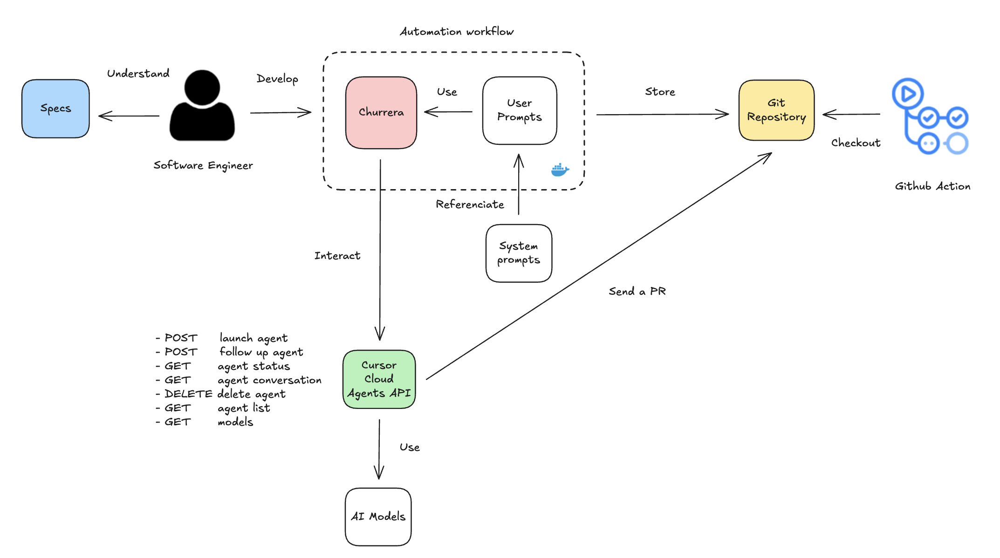
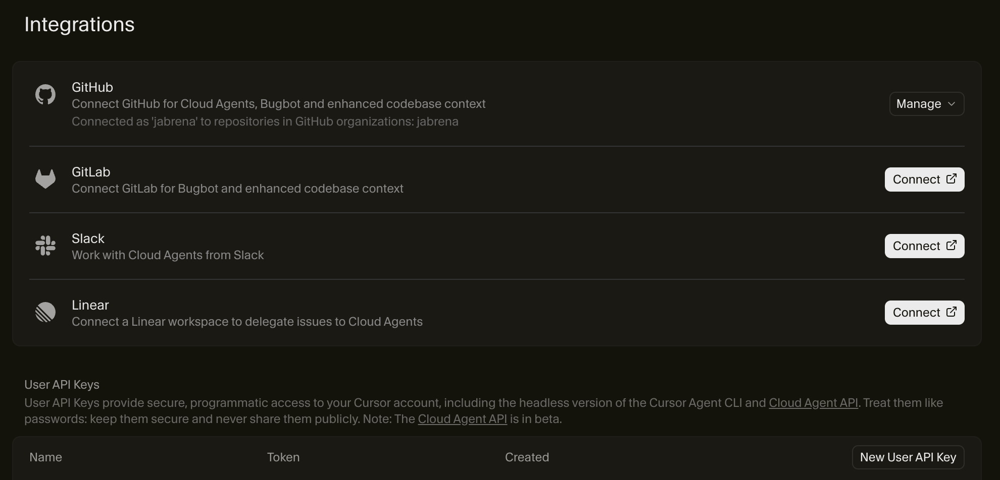
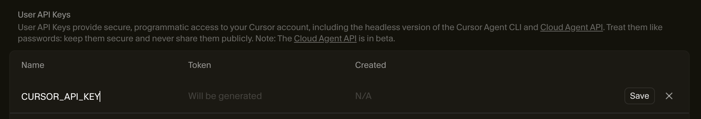
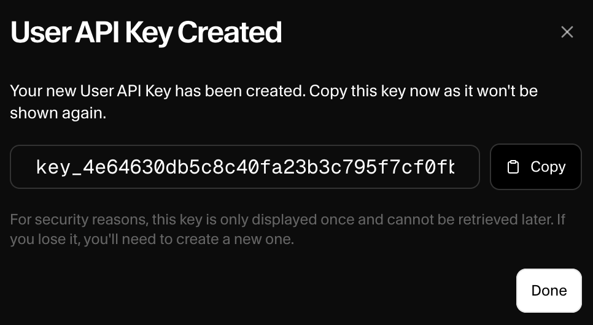
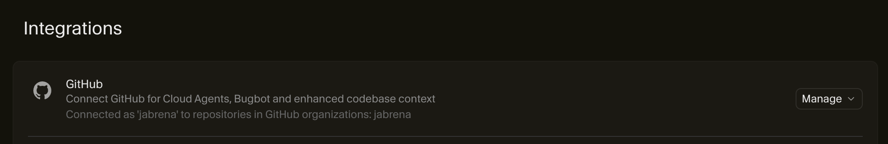
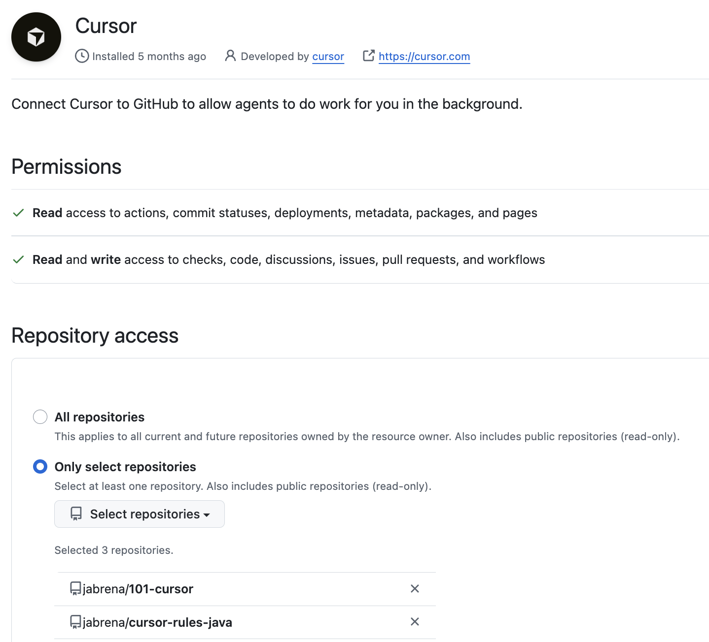

# Churrera

[](https://github.com/jabrena/churrera-cli/actions/workflows/maven.yaml)

[](https://sonarcloud.io/summary/new_code?id=jabrena_churrera-cli)

## Goal

`Churrera` is a CLI tool designed to orchestrate `Cursor Cloud Agents REST API` in an easy way.

## What is Cursor Cloud Agents REST API?

Cursor Cloud Agents REST API (Beta) allows you to programmatically create and manage AI-powered coding agents that work autonomously on your repositories.

**OpenAPI:** https://editor-next.swagger.io/?url=https://cursor.com/docs-static/cloud-agents-openapi.yaml

## How does it work?

`Churrera CLI` processes a `PML-Workflow` file which defines a Job to be processed and it is composed of one or more `Prompts` which are executed by a `Frontier model`.



## Agentic patterns

### Sequence

```xml
<?xml version="1.0" encoding="UTF-8"?>
<pml-workflow xmlns:xsi="http://www.w3.org/2001/XMLSchema-instance"
    xsi:noNamespaceSchemaLocation="https://jabrena.github.io/pml/schemas/0.3.0/pml-workflow.xsd">
    <sequence model="default" repository="https://github.com/jabrena/wjax25-demos"
     timeout="3m" fallback="fallback.xml">
        <prompt src="pml-java25-installation-v5.xml" />
        <prompt src="pml-hello-world-java-v2.xml" />
    </sequence>
</pml-workflow>
```

### Parallel

```xml
<?xml version="1.0" encoding="UTF-8"?>
<pml-workflow xmlns:xsi="http://www.w3.org/2001/XMLSchema-instance"
    xsi:noNamespaceSchemaLocation="https://jabrena.github.io/pml/schemas/0.3.0/pml-workflow.xsd">
    <parallel src="euler-problem-extractor-prompt.xml" bindResultType="List_Integer">
        <sequence model="default" repository="https://github.com/jabrena/wjax25-demos">
            <prompt src="euler-problem-solver-prompt.xml" bindResultExp="$get()"/>
        </sequence>
    </parallel>
</pml-workflow>
```

**Note:** [Review examples to get inspiration](./churrera-cli/src/test/resources/examples/).

## Getting started

### 1. Generate a CURSOR_API_KEY

Visit [Integrations](https://cursor.com/dashboard?tab=integrations) in Cursor to generate a new `CURSOR_API_KEY` and click the button `New User API Key` to generate it:



Type the name that you want and click the `Save` button to generate the new `CURSOR_API_KEY`:



Then a popup window will appear with the `CURSOR_API_KEY` created:



### 2. Store or put visible CURSOR_API_KEY to be used by Churrera

With the new `CURSOR_API_KEY` created, you could add it into the `.env` file with the following format:

```bash
CURSOR_API_KEY=key_xxx
```

**Note:** Remember to add the file `.env` inside of a `.cursorignore` file. Further information about it [here](https://cursor.com/docs/context/ignore-files).

On the other hand, you could use that `CURSOR_API_KEY` and export it as an environment variable in your system:

```bash
export CURSOR_API_KEY=key_xxx
```

**Note:** Churrera reads `CURSOR_API_KEY` values from a .env file stored in the same path where you run Churrera or define an environment variable in your terminal.

### 3. Give Cursor permissions to interact with Github

Configure Github to allow Cursor to interact with the repository that you want Cursor Cloud Agents to interact with, so visit [Integrations](https://cursor.com/dashboard?tab=integrations) and click the button `Manage` in the Github area.



**Note:** In the future, Cursor Cloud Agents may support `Gitlab` as well.

Once you are in Github, you will have to select which `Github User` you are going to give permissions to and click the `Configure` link:


Once you have installed Cursor in your Github User, you will need to define which repositories you will give permissions to:



You will indicate in the attribute `repository` the repository that you defined before in the `pml-workflow` file.

### 4. Running your first PML Workflow

**1. Define a `pml-workflow` file:**

```xml
<?xml version="1.0" encoding="UTF-8"?>
<pml-workflow xmlns:xsi="http://www.w3.org/2001/XMLSchema-instance"
    xsi:noNamespaceSchemaLocation="https://jabrena.github.io/pml/schemas/0.3.0/pml-workflow.xsd">
    <sequence model="default" repository="https://github.com/jabrena/wjax25-demos">
        <prompt src="pml-hello-world-bash.xml" />
    </sequence>
</pml-workflow>
```

**2. Define a `PML` prompt file:**

```xml
<?xml version="1.0" encoding="UTF-8"?>
<prompt xmlns:xsi="http://www.w3.org/2001/XMLSchema-instance"
        xsi:noNamespaceSchemaLocation="https://jabrena.github.io/pml/schemas/0.3.0/pml.xsd">
    <goal>
        Print "Hello World" in the console using a echo command
    </goal>
</prompt>
```

Further information about `PML` [here](https://github.com/jabrena/pml).

**3. Launch the tool:**

Build & run Churrera:

```bash
#JBang
sdk install jbang

jbang trust add https://github.com/jabrena/
jbang cache clear
jbang catalog list jabrena

# Single execution (Designed for Pipelines)
jbang churrera@jabrena run \
--workflow churrera-cli/src/test/resources/examples/hello-world-bash/workflow-hello-world.xml --delete-on-success-completion
jbang churrera@jabrena run --workflow churrera-cli/src/test/resources/examples/hello-world/workflow-hello-world.xml --show-logs --delete-on-success-completion
jbang churrera@jabrena run --retrieve-models
jbang churrera@jabrena run --retrieve-repositories
```

Follow the output from the tool:

```bash

   ____ _                                      ____ _     ___
  / ___| |__  _   _ _ __ _ __ ___ _ __ __ _   / ___| |   |_ _|
 | |   | '_ \| | | | '__| '__/ _ \ '__/ _` | | |   | |    | |
 | |___| | | | |_| | |  | | |  __/ | | (_| | | |___| |___ | |
  \____|_| |_|\__,_|_|  |_|  \___|_|  \__,_|  \____|_____|___|


A CLI tool designed to orchestrate Cursor Cloud Agents REST API.

Version: 0.2.0-SNAPSHOT
Commit: 1ccefe4

✓ CURSOR_API_KEY validated

Job registered

| Job ID   | Parent Job | Type     | Prompts | Status   | Last update    | Completed      |
+----------+------------+----------+---------+----------+----------------+----------------+
| 492f5d67 | NA         | SEQUENCE | 0/1     | CREATING | 11/18/25 19:20 | Started 4s ago |

| Job ID   | Parent Job | Type     | Prompts | Status  | Last update    | Completed       |
+----------+------------+----------+---------+---------+----------------+-----------------+
| 492f5d67 | NA         | SEQUENCE | 0/1     | RUNNING | 11/18/25 19:20 | Started 10s ago |

| Job ID   | Parent Job | Type     | Prompts | Status   | Last update    | Completed |
+----------+------------+----------+---------+----------+----------------+-----------+
| 492f5d67 | NA         | SEQUENCE | 1/1     | FINISHED | 11/18/25 19:20 | 15 secs   |


Job completed with status: FINISHED
Deleting job and all child jobs...
Job and all child jobs deleted successfully

Thanks for using Churrera! ✨
```

## Using the tool

```bash
#JBang
sdk install jbang

jbang trust list
jbang trust add https://github.com/jabrena/
jbang cache clear
jbang catalog list jabrena

jbang churrera@jabrena --help
# Single execution (Designed for Pipelines)
jbang churrera@jabrena run --help
jbang churrera@jabrena run --workflow churrera-cli/src/test/resources/examples/hello-world-bash/workflow-hello-world.xml
jbang churrera@jabrena run --workflow churrera-cli/src/test/resources/examples/hello-world/workflow-hello-world.xml --show-logs
jbang churrera@jabrena run --workflow churrera-cli/src/test/resources/examples/euler-problems/workflow-euler.xml

# Run REPL (Ideal for long lived sessions in local)
jbang churrera@jabrena cli

jobs                    # List all jobs
jobs new    churrera-cli/src/test/resources/examples/hello-world/workflow-hello-world.xml
jobs new    churrera-cli/src/test/resources/examples/cis194/workflow-cis194.xml
jobs new    churrera-cli/src/test/resources/examples/euler-problems/workflow-euler.xml
jobs new    churrera-cli/src/test/resources/examples/aoc/workflow-aoc.xml
jobs status <job-id>    # Check job status
jobs logs   <job-id>    # View job logs and conversation
jobs delete <job-id>    # Delete job and associated Cursor agent
jobs pr     <job-id>    # Show PR link
```

## Build in local

```bash
./mvnw clean package -DskipTests
java -jar churrera-cli/target/churrera-cli-0.2.0-SNAPSHOT.jar run --help
java -jar churrera-cli/target/churrera-cli-0.2.0-SNAPSHOT.jar run --workflow churrera-cli/src/test/resources/examples/hello-world-bash/workflow-hello-world.xml --delete-on-success-completion --polling-interval 10
java -jar churrera-cli/target/churrera-cli-0.2.0-SNAPSHOT.jar run --workflow churrera-cli/src/test/resources/examples/hello-world-bash/workflow-hello-world.xml --delete-on-completion
java -jar churrera-cli/target/churrera-cli-0.2.0-SNAPSHOT.jar run --workflow churrera-cli/src/test/resources/examples/hello-world/workflow-hello-world.xml --delete-on-success-completion --show-logs
java -jar churrera-cli/target/churrera-cli-0.2.0-SNAPSHOT.jar run --workflow churrera-cli/src/test/resources/examples/euler-problems/workflow-euler.xml --delete-on-success-completion --polling-interval 5 --show-logs
java -jar churrera-cli/target/churrera-cli-0.2.0-SNAPSHOT.jar run --retrieve-models
java -jar churrera-cli/target/churrera-cli-0.2.0-SNAPSHOT.jar run --retrieve-repositories
java -jar churrera-cli/target/churrera-cli-0.2.0-SNAPSHOT.jar run --workflow churrera-cli/src/test/resources/examples/failed-job/workflow.xml --delete-on-completion --show-logs
```

## Changelog

- Review the [CHANGELOG](./CHANGELOG.md) for further details

## References

- https://cursor.com/docs/cloud-agent/api/overview
- https://status.cursor.com/
- https://discord.com/channels/1074847526655643750/1074847527708393565

## Cursor rules ecosystem

- https://github.com/jabrena/101-cursor
- https://github.com/jabrena/pml
- https://github.com/jabrena/churrera-cli
- https://github.com/jabrena/cursor-cloud-agent-rest-api-status
- https://github.com/jabrena/cursor-rules-agile
- https://github.com/jabrena/cursor-rules-java
- https://github.com/jabrena/cursor-rules-spring-boot
- https://github.com/jabrena/puml-to-png-cli
- https://github.com/jabrena/setup-cli
- https://github.com/jabrena/jbang-catalog

Powered by [Cursor](https://www.cursor.com/) with ❤️ from [Madrid](https://www.google.com/maps/place/Community+of+Madrid,+Madrid/@40.4983324,-6.3162283,8z/data=!3m1!4b1!4m6!3m5!1s0xd41817a40e033b9:0x10340f3be4bc880!8m2!3d40.4167088!4d-3.5812692!16zL20vMGo0eGc?entry=ttu&g_ep=EgoyMDI1MDgxOC4wIKXMDSoASAFQAw%3D%3D)
