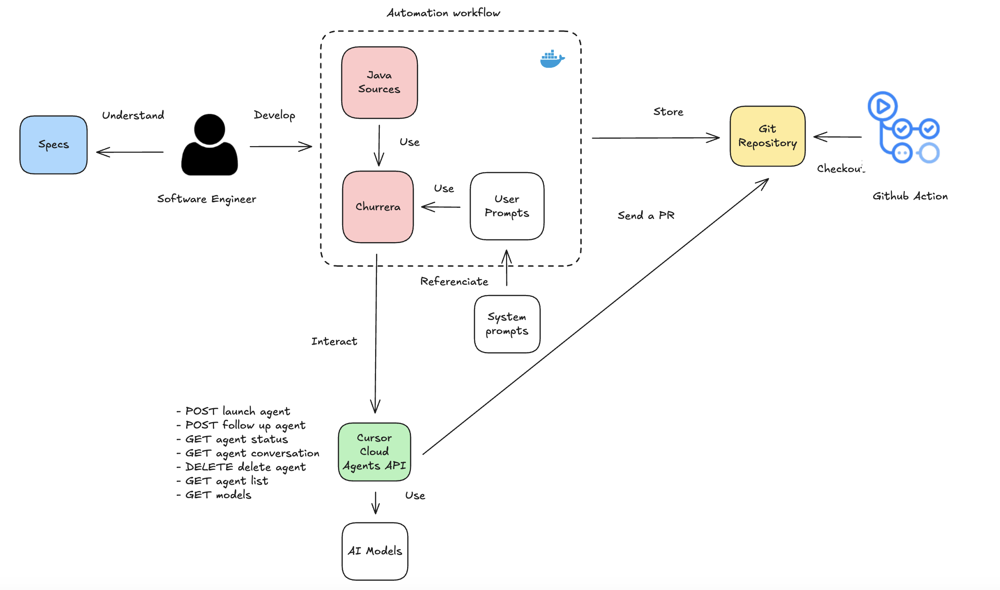

# Churrera

## Goal

Churrera is a Java development CLI tool designed to operate with `Cursor Cloud Agents API` in an easy way.

## What is Cursor Cloud Agents API?

Cursor Cloud Agents API (Beta) allows you to programmatically create and manage AI-powered coding agents that work autonomously on your repositories.

**OpenAPI:** https://editor-next.swagger.io/?url=https://cursor.com/docs-static/cloud-agents-openapi.yaml



## How to use the tool?

**1. Define a `pml-workflow` file:**

```xml
<?xml version="1.0" encoding="UTF-8"?>
<pml-workflow xmlns:xsi="http://www.w3.org/2001/XMLSchema-instance"
              xsi:noNamespaceSchemaLocation="https://jabrena.github.io/pml/schemas/0.2.0/pml-workflow.xsd">
    <sequence model="default" repository="https://github.com/jabrena/dvbe25-demos">
        <prompt src="prompt1.xml" type="pml" />
        <prompt src="prompt2.md" type="md" />
    </sequence>
</pml-workflow>
```

**2. Provide a valid CURSOR_API_KEY:**

In the path where you going to run churrera, define `.env` with:

```bash
CURSOR_API_KEY=your_key_xxx
```

or have a System environment variable with the name `CURSOR_API_KEY`:

```bash
export CURSOR_API_KEY=your_key_xxx
```

**3. Launch the tool:**

```bash
# Build
./mvnw clean package
# Run
java -jar churrera-cli/target/churrera-cli-0.2.0-SNAPSHOT.jar

# Using the commands
jobs                    # List all jobs
jobs new    churrera-cli/src/test/resources/examples/hello-world/workflow-hello-world.xml
jobs new    churrera-cli/src/test/resources/examples/cis194/workflow-cis194.xml
jobs new    churrera-cli/src/test/resources/examples/euler-problems/workflow-euler.xml
jobs new    churrera-cli/src/test/resources/examples/aoc/workflow-aoc.xml
jobs status <job-id>    # Check job status
jobs logs   <job-id>    # View job logs and conversation
jobs delete <job-id>    # Delete job and associated Cursor agent
jobs pr     <job-id>    # Show PR link

#JBang
sdk install jbang

jbang trust list
jbang cache clear
jbang catalog list
jbang catalog list jabrena

jbang churrera@jabrena
```

## Agentic patterns

### Sequence

```xml
<?xml version="1.0" encoding="UTF-8"?>
<pml-workflow xmlns:xsi="http://www.w3.org/2001/XMLSchema-instance"
              xsi:noNamespaceSchemaLocation="https://jabrena.github.io/pml/schemas/0.2.0/pml-workflow.xsd">
    <sequence model="default" repository="https://github.com/jabrena/wjax25-demos">
        <prompt src="prompt1.xml" type="pml" />
        <prompt src="prompt2.xml" type="pml" />
    </sequence>
</pml-workflow>
```

### Parallel

```xml
<?xml version="1.0" encoding="UTF-8"?>
<pml-workflow xmlns:xsi="http://www.w3.org/2001/XMLSchema-instance"
              xsi:noNamespaceSchemaLocation="https://jabrena.github.io/pml/schemas/0.2.0/pml-workflow.xsd">
    <parallel src="prompt-toc.xml" type="pml" bindResultType="List_Integer">
        <sequence model="default" repository="https://github.com/jabrena/wjax25-demos">
            <prompt src="prompt1.xml" type="pml" bindResultExp="$get()" />
            <prompt src="prompt2.xml" type="pml" />
        </sequence>
    </parallel>
</pml-workflow>
```

**Note:** [Review examples to get inspiration](./churrera-cli/src/test/resources/examples/).

## Changelog

- Review the [CHANGELOG](./CHANGELOG.md) for further details

## References

- https://cursor.com/docs/cloud-agent/api/overview
- https://status.cursor.com/
- https://discord.com/channels/1074847526655643750/1074847527708393565

## Cursor rules ecosystem

- https://github.com/jabrena/101-cursor
- https://github.com/jabrena/pml
- https://github.com/jabrena/cursor-rules-agile
- https://github.com/jabrena/cursor-rules-java
- https://github.com/jabrena/cursor-rules-spring-boot
- https://github.com/jabrena/plantuml-to-png-cli
- https://github.com/jabrena/setup-cli
- https://github.com/jabrena/jbang-catalog

Powered by [Cursor](https://www.cursor.com/) with ❤️ from [Madrid](https://www.google.com/maps/place/Community+of+Madrid,+Madrid/@40.4983324,-6.3162283,8z/data=!3m1!4b1!4m6!3m5!1s0xd41817a40e033b9:0x10340f3be4bc880!8m2!3d40.4167088!4d-3.5812692!16zL20vMGo0eGc?entry=ttu&g_ep=EgoyMDI1MDgxOC4wIKXMDSoASAFQAw%3D%3D)
