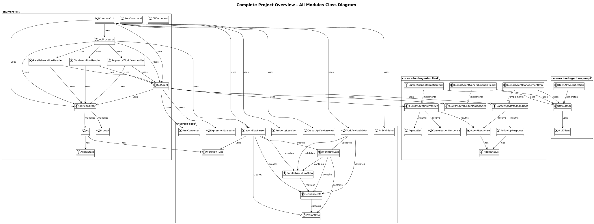
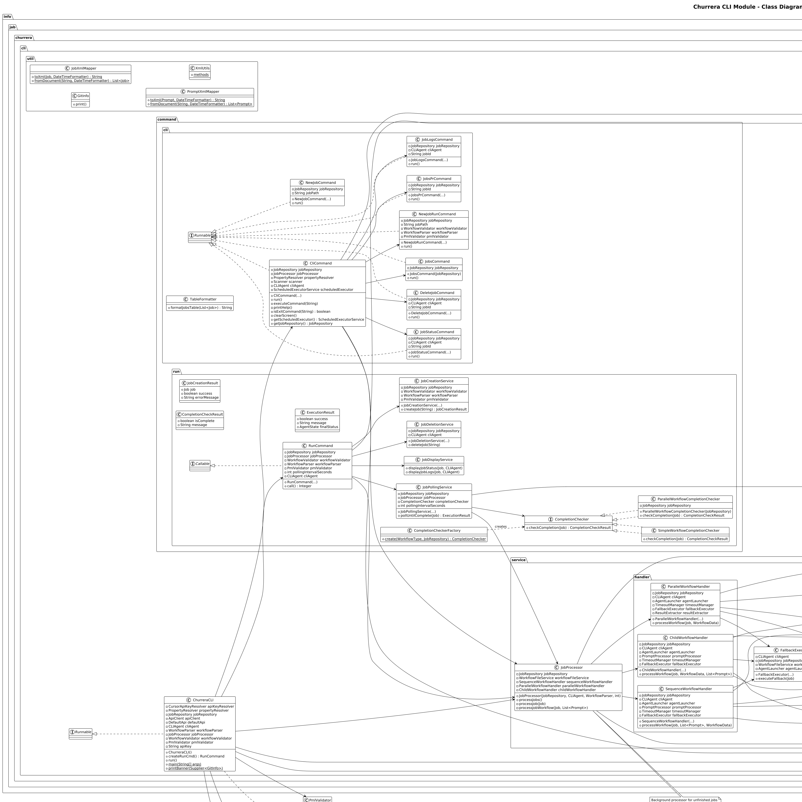
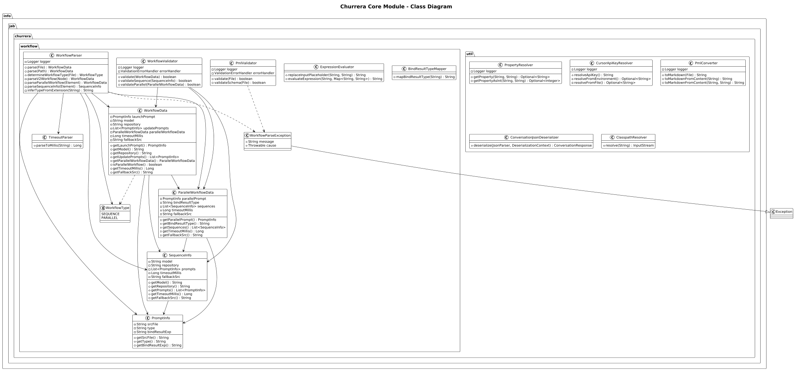
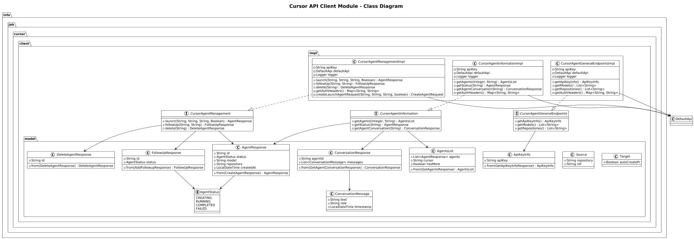

# UML Class Diagrams

This document provides an overview of the class structure for the Churrera project through UML class diagrams.

## Complete Project Overview

The complete diagram shows all modules and their relationships across the entire project.

The complete diagram includes:
- **churrera-cli**: Command-line interface components
- **churrera-core**: Core workflow and utility functionality
- **cursor-cloud-agents-client**: Cursor API client implementations
- **cursor-cloud-agents-openapi**: OpenAPI specifications

## Module Diagrams

### Churrera CLI Module

The CLI module contains the command-line interface components, including commands, services, repositories, and models for managing jobs.

**Key Components:**
- **Commands**: `CliCommand`, `RunCommand`, `JobsCommand`, and other CLI commands
- **Services**: `CLIAgent` for agent management, `JobProcessor` for job processing
- **Repository**: `JobRepository` for data persistence
- **Models**: `Job`, `JobWithDetails`, `Prompt` for data representation

### Churrera Core Module

The core module provides workflow parsing, validation, and utility functions used across the application.

**Key Components:**
- **Workflow**: `WorkflowParser`, `WorkflowData`, `WorkflowValidator` for workflow management
- **Types**: `WorkflowType` enum, `AgentState` enum
- **Utilities**: `PmlConverter`, `PropertyResolver`, `CursorApiKeyResolver`

### Cursor API Client Module

The client module provides interfaces and implementations for interacting with the Cursor API.

**Key Components:**
- **Interfaces**: `CursorAgentManagement`, `CursorAgentInformation`, `CursorAgentGeneralEndpoints`
- **Implementations**: `CursorAgentManagementImpl`, `CursorAgentInformationImpl`, `CursorAgentGeneralEndpointsImpl`
- **Models**: `AgentResponse`, `FollowUpResponse`, `ConversationResponse` for API responses

## Diagram Generation

These diagrams are automatically generated from the source code. The PlantUML source files (`.puml`) are located in the `puml/` subdirectory and can be regenerated as needed.
